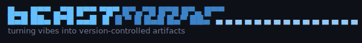
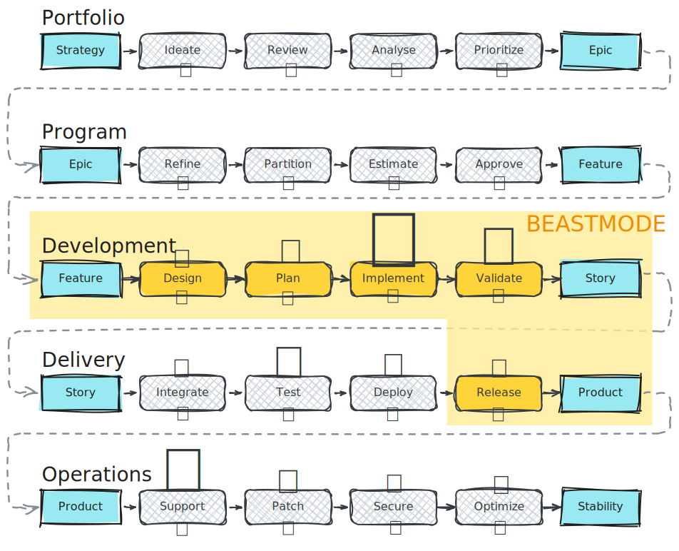

Workflow skills for Claude Code. Design, plan, implement, validate, release. Context persists across sessions. A meta layer learns from every cycle.

## What It Does

Without structure, you re-explain your project every session, get inconsistent results, and lose work between context windows.

Beastmode fixes this. Five phases. Context persists. Patterns compound.

```
/design → /plan → /implement → /validate → /release
```

**Quick fix?** Implement, done.
**New feature?** Design the approach. Plan the tasks. Implement. Validate. Release.
**Multi-session?** Each phase writes artifacts to `.beastmode/`. Next session picks up where you left off.

## Install

```bash
claude plugin add beastmode@beastmode-marketplace
```

Then initialize your project:

```bash
/beastmode install                # scaffold .beastmode/ structure
/beastmode init --brownfield      # auto-discover existing codebase
```

## Skills

| Skill | What it does |
|-------|-------------|
| `/design` | Brainstorm and create design specs through collaborative dialogue |
| `/plan` | Turn designs into bite-sized implementation tasks |
| `/implement` | Execute plans in isolated git worktrees |
| `/validate` | Quality gate — tests, lint, type checks |
| `/release` | Changelog, version bump, merge to main |
| `/status` | Track project state and milestones |
| `/beastmode` | Project initialization and discovery |

## How It Works

Five phases, one flow:

```
/design → /plan → /implement → /validate → /release
```

Each phase stands on its own. Prime loads context, execute does the work, validate checks quality, checkpoint saves artifacts. Session ends. Next phase starts clean. Fresh context, no leftover state, just the artifacts the previous phase wrote.

`.beastmode/` is the shared bus. Design specs, implementation plans, validation records, release notes. All markdown, all in git. Your root `CLAUDE.md` imports the project context. Every new session starts with full knowledge of your project.

Four domains organize what gets persisted:

- **Product** — what you're building (vision, goals)
- **Context** — how to build it (architecture, conventions, testing)
- **State** — where features are in the workflow (design → release)
- **Meta** — what you've learned (SOPs, overrides, session insights)

## What Makes It Work

**Progressive context, not flat retrieval.**

Beastmode organizes project knowledge into four levels. Each level summarizes the level below. Agents navigate summaries first and load detail only when the task requires it. Deterministic navigation through a known structure, not similarity search through a vector space.


Every phase follows the same four steps: prime loads context from `.beastmode/`, execute does the work, validate checks quality, checkpoint saves artifacts back.

```
prime → execute → validate → checkpoint
```

Next phase starts in a fresh session. Prime reads what checkpoint wrote. Phases share artifacts, not memory. The handoff is explicit, not implicit. No vector database to maintain. No embeddings to regenerate. Context survives sessions, branches, and collaborators because it's just markdown files in git.

[Read the full argument →](docs/progressive-hierarchy.md)

**Self-learning through retrospectives.**

Every checkpoint captures what worked, what didn't, and what to do differently. Retro agents classify each finding into one of three categories:

- **SOPs** — reusable procedures that apply across sessions
- **Overrides** — project-specific rules that customize phase behavior
- **Learnings** — session insights, friction points, patterns noticed

Recurring learnings auto-promote to SOPs after appearing in 3+ sessions. Each cycle sharpens Claude's understanding of *your* codebase, not codebases in general. The meta domain feeds back into prime, so the next session starts smarter than the last.


**Progressive autonomy through configurable gates.**

Every phase has human-in-the-loop gates: design approval, plan review, version confirmation, merge strategy. By default, all gates require human input. As trust builds, flip individual gates to `auto` in `.beastmode/config.yaml`:

```yaml
# .beastmode/config.yaml
gates:
  design:
    gray-area-discussion: human   # start supervised
    design-approval: human
  plan:
    plan-approval: auto           # trust the plan phase
  implement:
    architectural-deviation: auto # claude handles deviations
transitions:
  design-to-plan: auto            # auto-chain between phases
  plan-to-implement: auto
```

Start with human everywhere. Flip gates to auto as patterns prove reliable. The structure scales from fully supervised to fully autonomous. Same workflow, different level of trust.

## Why?

Software doesn't get built by a lone developer anymore. It moves through layers.



Portfolio decides what matters. Program breaks it into features. Development turns features into code. Delivery ships it. Operations keeps it alive. Frameworks like SAFe formalize this into five layers, each with its own rituals, roles, and artifacts.

Every layer has tooling — except the one where the code actually gets written.

Portfolio has Jira, Aha!, ProductBoard. Program has PI planning boards and capacity calculators. Delivery has CI/CD pipelines, feature flags, deployment orchestrators. Operations has Datadog, PagerDuty, Kubernetes. These layers are drowning in tooling.

Development? You get an IDE and good luck.

The Development layer — where a feature becomes a design, a design becomes a plan, a plan becomes code, and code becomes a validated story — has no structural tooling. Developers carry the entire workflow in their heads. Context lives in memory. Decisions evaporate between sessions. The handoff from "I understand the feature" to "here's a tested story" is entirely manual.

This is where beastmode lives. Not portfolio strategy. Not CI/CD. Not monitoring. Just the five steps where a feature becomes working code:

```
Feature → Design → Plan → Implement → Validate → Story
```

That's it. The gap nobody tools for, because it's "just development." But it's also where the most context gets lost, where the most rework happens, and where AI agents have the most leverage — if they have structure to work within.

Beastmode gives them that structure.

## Credits

Built on ideas from [superpowers](https://github.com/obra/superpowers) and [get-shit-done](https://github.com/gsd-build/get-shit-done).

See the full [Changelog](CHANGELOG.md).

## License

MIT
